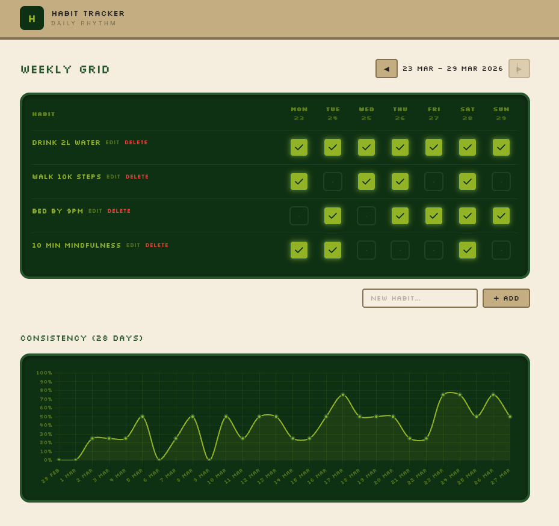

# Habit Tracker

A simple Rails app for tracking daily habits and visualizing your consistency over time.



## Ruby version

- Ruby `3.4.8` (see [.ruby-version](.ruby-version))
- Rails `~> 8.1.2`

## System dependencies

- SQLite 3 (`>= 2.1`)
- Node-free asset pipeline via [Propshaft](https://github.com/rails/propshaft) and [tailwindcss-rails](https://github.com/rails/tailwindcss-rails)
- [Foreman](https://github.com/ddollar/foreman) (optional, used by `bin/dev`)
- Docker (optional, for containerized deploys via Kamal)

## Database creation

```sh
bin/rails db:create
```

## Database initialization

```sh
bin/rails db:migrate
bin/rails db:seed
```

## How to run the test suite

```sh
bin/rails test          # unit and integration tests
bin/rails test:system   # system tests via Capybara + Selenium
```

## Running the app locally

```sh
bin/setup   # install gems and prepare the database
bin/dev     # start Rails, Tailwind watcher, and job runner via Procfile.dev
```

Then visit http://localhost:3000.

## Code quality and security

```sh
bin/rubocop         # Ruby style checks (rails-omakase)
bin/brakeman        # static security analysis
bin/bundler-audit   # audit gems for known CVEs
bin/ci              # run the full CI pipeline
```

